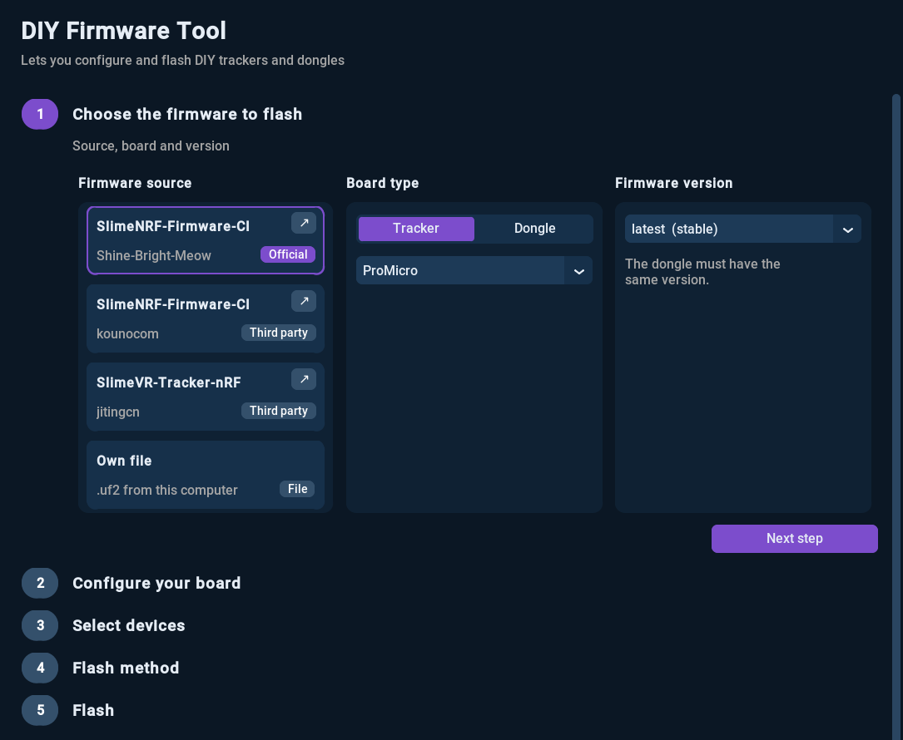
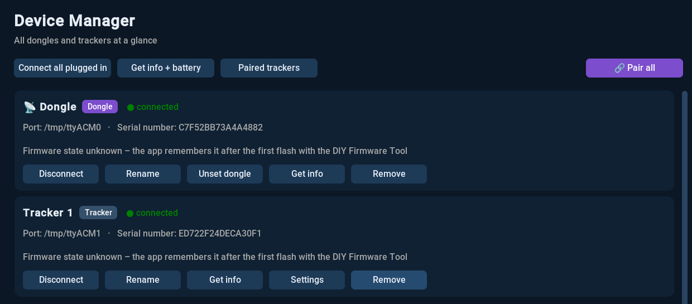

# SmolSlime Configurator 

Unofficial desktop app to connect, configure and flash **SlimeVR Smol Slime (SlimeNRF)** trackers and dongles.

This is a fork of the [SmolSlime Configurator by ICantMakeThings](https://github.com/ICantMakeThings/SmolSlimeConfigurator). It keeps the original buttons and terminal and adds a firmware wizard, a device manager, multi-device support and installers for Linux and Windows.

The interface is in **English** by default and can be switched to **German** under *Settings → Language*.



## Installation

All files are on the [Releases](https://github.com/LucyWolf/SmolSlimeConfigurator/releases/latest) page.

### Windows

Download [`SmolSlimeConfigurator-setup.exe`](https://github.com/LucyWolf/SmolSlimeConfigurator/releases/latest/download/SmolSlimeConfigurator-setup.exe) and double-click it.

- Installs for your user only, no admin rights needed
- Adds a Start menu entry (desktop shortcut optional)
- Can be uninstalled under *Settings → Apps*
- No drivers needed on Windows 10/11

If you don't want to install anything, you can run `SmolSlimeConfigurator-Windows.exe` directly.

### Linux

Download the installer for your distribution and double-click it. The first time, your file manager asks whether it may run the file.

| Distribution | Installer |
|---|---|
| Arch / CachyOS / Manjaro | [`SmolSlimeConfigurator-arch-installer.desktop`](https://github.com/LucyWolf/SmolSlimeConfigurator/releases/latest/download/SmolSlimeConfigurator-arch-installer.desktop) |
| Debian / Ubuntu | [`SmolSlimeConfigurator-deb-installer.desktop`](https://github.com/LucyWolf/SmolSlimeConfigurator/releases/latest/download/SmolSlimeConfigurator-deb-installer.desktop) |
| Everything else (Fedora, openSUSE, …) | [`SmolSlimeConfigurator-installer.desktop`](https://github.com/LucyWolf/SmolSlimeConfigurator/releases/latest/download/SmolSlimeConfigurator-installer.desktop) |

The installer:

- downloads the latest version
- installs missing packages (udisks2, XWayland)
- sets up USB access for the trackers (asks for your password once)
- adds a menu entry

Running it again offers **Update** or **Uninstall**. On Wayland the app runs through XWayland.

<details>
<summary>Prefer the terminal?</summary>

```bash
curl -fsSL -o SmolSlimeConfigurator-installieren.sh https://github.com/LucyWolf/SmolSlimeConfigurator/releases/latest/download/SmolSlimeConfigurator-installieren.sh
bash SmolSlimeConfigurator-installieren.sh
```
</details>

### Updates

The app checks for a new version on start. If there is one, click **⬆ Update** in the top bar.

## Features

### DIY Firmware Tool
A step-by-step wizard modeled on the SlimeVR Server: source → board → version → build → devices → flash method → flash.

- Firmware sources: **Shine-Bright-Meow** (official), **kounocom**, **jitingcn**, or your own `.uf2` file
- Pick the build options (form factor, sensor bus, magnetometer, sensor clock, sleep mode, button, …); every option has a **?** with an explanation
- If a combination doesn't exist, the tool suggests the closest ones or searches all sources
- Flashes **several trackers at once** (one after another on Windows)
- **UF2 bootloader** for trackers and ProMicro dongles, **Nordic serial bootloader** for `.hex` dongles (Holyiot, eByte, Nordic), without nRF Connect
- Can reflash a ProMicro from tracker to dongle and back
- Warns before flashing if the firmware doesn't match the connected device
- Optional: write firmware settings into the trackers right after flashing

### Device Manager


- All dongles and trackers at a glance, with port and serial number
- Firmware, board, sensor and battery via **Get info + battery**
- List of trackers paired to the dongle
- **Settings** stored directly in a tracker (sleep, sensor, button, radio, …) without reflashing
- Remembers which firmware the app flashed onto each device and shows whether an **update** is available

### Main window
- Several devices connected at the same time, each with its own terminal; switch on the left
- SlimeNRF devices connect automatically; set one as **dongle** and it reconnects by itself
- **🔗 Pair** puts the dongle and all connected trackers into pairing mode at once
- The original buttons: Info, Reboot, Scan, Calibrate, Calibrate 6 Sides, Mag Clear, Battery, Pairing Mode, Clear Con. Data, DFU, Uptime, Debug
- On Linux, a missing USB permission ("Permission denied") can be fixed with one password prompt

## Usage

### Flashing
1. Plug in the trackers (or the dongle) via USB.
2. Open **DIY Firmware Tool**, choose source, *Tracker* or *Dongle*, board and version.
3. Pick the build options, select the devices and start flashing.

The app sends the devices into the bootloader by itself. For firmware without the `dfu` command, it asks you to press reset four times quickly. Holyiot dongles enter the bootloader by holding the included magnet to the LED; the app tells you when.

A brand-new ProMicro without SlimeNRF firmware has to be put into the bootloader by hand once: bridge **RST** and **GND** twice quickly.

**Trackers and dongle need the same firmware version**, otherwise they won't pair.

### Pairing
Connect the dongle and the trackers, then press **🔗 Pair** (main window) or **🔗 Pair all** (Device Manager). When all trackers show up, end pairing mode on the *Receiver* tab.

If a tracker has old pairing data, it won't connect: plug it in and press **Clear Con. Data**.

### Calibration
Press **Calibrate 6 Sides** and follow the terminal. Then press **Calibrate** and leave the tracker still on a desk for about 5 seconds. Double-tapping the tracker's button works instead of **Calibrate**.

More in the official [SmolSlime docs](https://docs.slimevr.dev/smol-slimes/).

## Building from source

Python **3.10**:

```bash
pip install pyinstaller customtkinter pyserial requests
pyinstaller --onefile --windowed --add-data "icon.png:." --add-data "assets:assets" SmolSlimeConfiguratorV9.py
```

On Windows use `;` instead of `:` in `--add-data` and add `--icon=icon.ico`.

**Releases (maintainers):** raise `APP_VERSION` in `SmolSlimeConfiguratorV9.py` (the last digit counts up to 99), push, run `tools/release.sh`. GitHub Actions builds and tests Linux and Windows (including the setup) and then publishes.

## Credits

- Original app: [ICantMakeThings/SmolSlimeConfigurator](https://github.com/ICantMakeThings/SmolSlimeConfigurator) (MIT). macOS and Android builds are available there.
- Schematic images: [SlimeVR docs](https://github.com/SlimeVR/SlimeVR-Docs-Site) (MIT), see `assets/bauform/QUELLEN.md`.
- Nordic serial DFU rebuilt in Python after Nordic's [pc-nrfutil](https://github.com/NordicSemiconductor/pc-nrfutil) (BSD).
- Web version of the original: [SmolSlimeWebConfigurator](https://github.com/jitingcn/SmolSlimeWebConfigurator) by jitingcn.

License: MIT, see [LICENSE](LICENSE).

---

## Eine Anmerkung zu diesem Projekt

Dieser Code wurde mit Claude AI erschaffen – und ich weiß, viele rümpfen bei diesen Worten die Nase. Trotzdem steht dieses Projekt für einen einfachen Gedanken: für alle da zu sein, ohne Ausnahme. Eine KI ist kein Wundermittel, das jedes Problem von selbst löst – sie ist ein Werkzeug, das seine Kraft erst durch die Hände entfaltet, die es führen. Und weil dahinter keine bezahlte Arbeit steckt, sondern nur die Zeit, die ich gerne investiert habe, wird dieses Programm niemals etwas kosten. Alle Dateien liegen offen, für jeden frei zugänglich und frei verwendbar.

Ich will an dieser Stelle ehrlich sein: Das hier ist KI-generiert, und ich beanspruche nicht, es selbst geschrieben zu haben. Diese Ehre gebührt mir nicht. Der 3D-Drucker hat einst Hobby-Ingenieure entstehen lassen, die damit Probleme des Alltags lösten, für die ihnen früher Wissen oder Mittel fehlten. Genau das kann – und sollte – auch KI sein: kein Wundermittel, sondern ein Werkzeug, das unser Leben einfacher macht. Ein Werkzeug, mit dem auch Menschen ohne Informatik-Hintergrund die kleinen, nervigen Probleme angehen können, die uns allen begegnen. Nicht aus Anspruch auf Genialität, sondern aus dem einfachen Wunsch, etwas besser zu machen.

<details>
<summary>A note on this project (English)</summary>

This code was created with Claude AI – and I know many people turn up their noses at those words. Still, this project stands for a simple idea: to be there for everyone, without exception. An AI is not a miracle cure that solves every problem by itself – it is a tool that only unfolds its power through the hands that guide it. And because there is no paid work behind it, only time I was happy to invest, this program will never cost anything. All files are open, freely accessible and free to use.

I want to be honest here: this is AI-generated, and I do not claim to have written it myself. That honor isn't mine. The 3D printer once gave rise to hobby engineers who solved everyday problems they previously lacked the knowledge or means for. That is exactly what AI can – and should – be: not a miracle cure, but a tool that makes our lives easier. A tool that lets people without a computer science background tackle the small, annoying problems we all run into. Not out of a claim to genius, but out of the simple wish to make something better.
</details>
